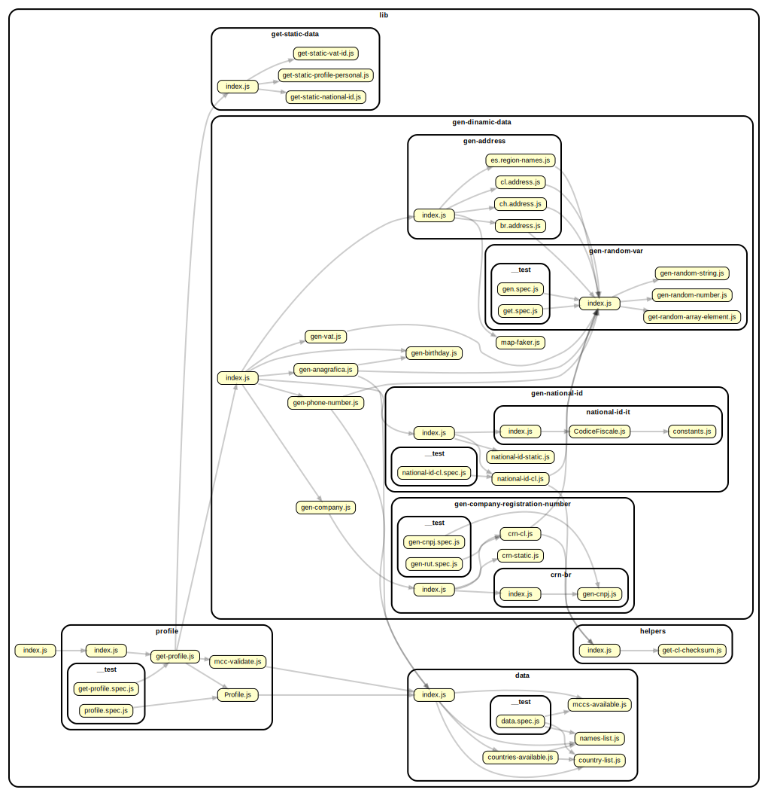

## Dependancies



## Output example:

```
{
  country: 'DE',
  credentials: { username: '', password: '' },
  personal_profile: {
    first_name: 'AutomationTest Celina',
    last_name: 'AutomationTest Vogt',
    date_of_birth: 1977-06-13T23:00:00.000Z,
    mobile_phone: '+491605857486',
    address: {
      country: 'DE',
      address_line1: '1287 Enrico Rue',
      address_line2: '',
      city: 'Süd Marisa',
      post_code: '15248',
      region_id: null,
      region_name: 'Schleswig-Holstein',
      landline: '+491605857486',
      first_name: 'AutomationTest Celina',
      last_name: 'AutomationTest Vogt',
      company: 'Umbrella Corp. DE'
    },
    national_id: 'T220001293'
  },
  merchant_profile: {
    legal_type_id: null,
    merchant_category_code: '7392',
    nature_and_purpose: 'Life is our purpose',
    company_name: 'Umbrella Corp. DE',
    vat_id: 'DE228412676',
    permanent_certificate_access_code: 'PCAC123456',
    website: 'http://villains.wikia.com/wiki/Umbrella_Corporation',
    mobile_phone: '+491605857486',
    address: {
      country: 'DE',
      address_line1: '1287 Enrico Rue',
      address_line2: '',
      city: 'Süd Marisa',
      post_code: '15248',
      region_id: null,
      region_name: 'Schleswig-Holstein',
      landline: '+491605857486',
      first_name: 'AutomationTest Celina',
      last_name: 'AutomationTest Vogt',
      company: 'Umbrella Corp. DE'
    }
  }

```
