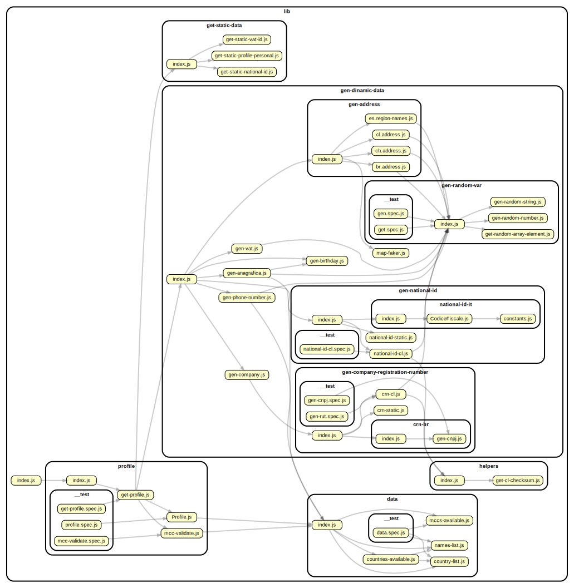

#  White Summoner

[](https://github.com/prettier/prettier) [](https://codecov.io/gh/ugobriasco/white-summoner)

## Intro

This is a node library for generating test users/merchants with realistic anagraphical data, address, phone numbers, MCCs and VAT ids. It is particularly suitable for eCom, fin-tech and KYC applications.

## Installation

```
  npm i white-summoner
```

## Usage

```
  const summonUser = require('white-summoner');

  // Get a user given country code
  summonUser("DE").then(user => console.log(user))

  /* Returns:
  {
    country: 'DE',
    personal_profile: {
      first_name: 'Kilian',
      last_name: 'Busch',
      date_of_birth: 1977-10-18T23:31:40.498Z,
      mobile_phone: '+491607793762',
      national_id: 'T220001293'
    },
    business_profile: {
      merchant_category_code: '7392',
      nature_and_purpose: 'Life is our purpose',
      company_name: 'Umbrella Corp. DE',
      vat_id: 'DE269991274',
      company_registration_number: 'T220001293',
      website: 'http://villains.wikia.com/wiki/Umbrella_Corporation',
      mobile_phone: '+491607793762'
    },
    address: {
      country: 'DE',
      address_line1: '5891 Zipse Station',
      address_line2: '78',
      city: 'Zimmerdorf',
      post_code: '80568',
      region_name: 'Baden-Württemberg',
      landline: '+491607793762',
      first_name: 'Kilian',
      last_name: 'Busch',
      company: 'Umbrella Corp. DE'
    }
  }
  */
```

### Covered country codes

```
 AL AR AM AU AT AZ BD BE BA BR BZ BG CA CL CN CO CR DK EG GB EE FI FR GE DE GR HU IN IR IL IT JP KR MX MA NP NL NZ NG NO PK PL PT RO RU SA SK SI ES SE CH TR UA US VN
```

_Note:_ not all the countries have complete coverage. In case of mistakes, please open an issue or contribute to the project

## Development

### Preequisites

- node 8+
- npm 6+
- dependency-cruiser 4+ (for updating dependency graph)

### Setup

```
  git clone git@github.com:ugobriasco/white-summoner.git
  cd ./white-summmoner
  npm i
```

### Test

Run `npm test` to execute the unit and integration tests. It requires the following framework:

- [Mocha](https://mochajs.org/).
- [Chai](http://chaijs.com).

You can also run unit tests (`npm run test:unit`) or integration tests (`npm run test:integration`) separately

### Architecture



### Sources

- https://github.com/greggles/mcc-codes

## Contributing

In lieu of a formal style guide, take care to maintain the existing coding style. Add unit tests for any new or changed functionality. Lint and test your code.

## License

MIT
